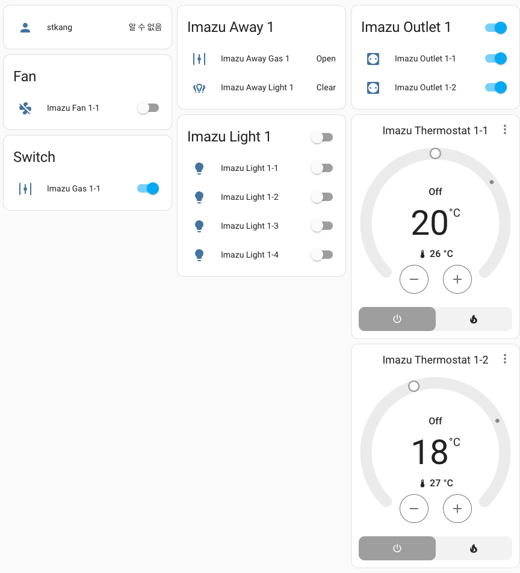
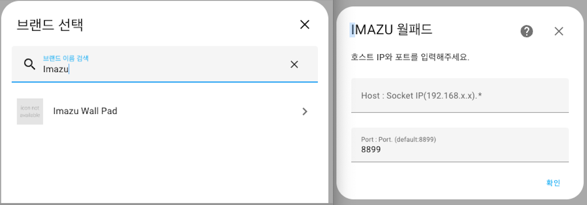

# 현대 HT: Imazu Wall Pad

![HACS][hacs-shield]



## 기능
- 전등 (Light): On/Off
- 스위치 (Outlet): On/Off
- 환풍기 (Fan): On/Off/Manual (Speed: 1,2,3)
- 보일러 (Climate): Off/Heat
- 가스 밸브 (Switch, Sensor): Only Close
- 외출 모드 (Sensor)

문의 : 네이버 [HomeAssistant카페](https://cafe.naver.com/koreassistant)

## 현대 HT: Imazu Wall Pad가 도움이 되셨나요?
TOSS로 기부하기  


## 준비물
- EW11
- HomeAssistant `최신버전`


## 사용자 구성요소를 HA에 설치하는 방법
### HACS
- HACS > Integrations > 우측상단 메뉴 > `Custom repositories` 선택
- `Add custom repository URL`에 `https://github.com/stkang/ha-component-imazu-wall-pad` 입력
- Category 는 `Integration` 선택 후 `ADD` 클릭
- HACS > Integrations 에서 `Imazu Wall Pad` 찾아서 설치
- HomeAssistant 재시작

### 수동설치
- `https://github.com/stkang/ha-component-imazu-wall-pad` 에서 `코드 -> 소스 코드 다운로드(zip)` 을 눌러 파일을 다운로드, 내부의 `imazu_wall_pad` 폴더 확인
- HomeAssistant 설정폴더 `/config` 내부에 `custom_components` 폴더를 생성(이미 있으면 다음 단계)<br/>설정폴더는 `configuration.yaml` 파일이 있는 폴더를 의미합니다.
- `/config/custom_components`에 위에서 다운받은 `imazu_wall_pad` 폴더를 넣기
- HomeAssistant 재시작

## Imazu Wall Pad 전 선행과정
### EW11 설정
Serial Port Settings
```
Basic Settings:
  Baud Rate: 9600
  Data Bit: 8
  Stop Bit: 1
  Parity: None
Buffer Settings:
  Buffer Size: 512
  Gap Time: 50
Flow Control Settings:
  Flow Control: Half Duplex
Cli Settings:
  Cli: Serial String
  Serial String: +++
  Waiting Time: 300
Protocol Settings:
  Protocol: None
```

Communication Settings
```
Basic Settings:
  Name: netp
  Protocol: Tcp Server
Socket Settings:
  Local Port: 8899
  Buffer Size: 512
  Keep Alive(s): 60
  Timeout(s): 0
Protocol Settings:
  Max Accept: 3
  Flow Control: Half Duplex
More Settings:
  Security: Disable
  Route: Uart
```


## Imazu Wall Pad을 통합구성요소로 설치하는 방법
### 통합구성요소
- HomeAssistant 사이드패널 > 설정 > 기기 및 서비스 > 통합 구성요소 추가
- 검색창에서 `Imazu` 입력 후 선택
- Host, Port 입력




[hacs-shield]: https://img.shields.io/badge/HACS-Custom-red.svg